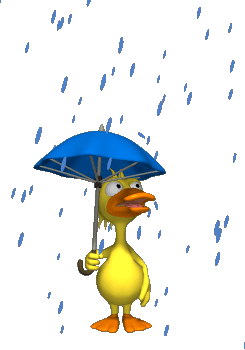

# 🌦️ Weather Forecast Web App

A beautiful, animated, and responsive Weather Forecast Web Application built using **HTML, CSS, and JavaScript**.
It shows **current weather**, **7-day forecast**, **animated GIFs**, and a **climate-based background** depending on the weather condition.

---

# 📌 Features

✅ Search weather by city name
✅ Shows **current temperature and condition**
✅ Displays **next 7 days forecast**
✅ Animated **weather GIF on left side**
✅ Climate-based **background image**
✅ Attractive **glitter forecast cards**
✅ Colored **weather icons**
✅ Fully **responsive design**
✅ Clean and modern UI

---

# 🖼️ Preview

### Weather Conditions Supported:

* ☀️ Clear → Sun GIF
* ☁️ Clouds → Cloud GIF
* 🌧️ Rain → Rain GIF
* ❄️ Snow → Snow GIF





---

# 🛠️ Technologies Used

* HTML5
* CSS3
* JavaScript
* OpenWeather API
* Font Awesome Icons

---

# 📁 Project Structure

```
weather-app/
│
├── index.html
├── style.css
├── script.js
│
├── default-climate-bg.jpg
│
├── clear.gif
├── cloud.gif
├── rain.gif
├── snow.gif
│
└── README.md
```

---

# 🔑 API Used

OpenWeather API

You need your own API key.

In script.js:

```js
const apiKey = "YOUR_API_KEY";
```

---

# ⚙️ How to Run Project

### Step 1

Download or Clone project

```
git clone https://github.com/yourusername/weather-app.git
```

---

### Step 2

Open folder

---

### Step 3

Open

```
index.html
```

in browser

---

# 💻 How it Works

1. User enters city name
2. App fetches weather data from API
3. Shows

* Temperature
* Weather condition
* GIF animation
* 7 day forecast

4. Background changes based on climate

---

# 🎨 UI Highlights

* Glassmorphism design
* Animated floating GIF
* Glitter borders
* Climate background

---


